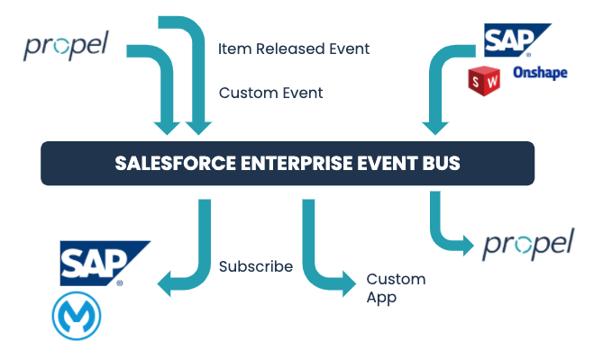

Propel, leveraging Salesforce technology, has the ability to send event-based messages to external systems in two primary ways. [Platform Events](platform-events.md) and [Outbound Messages](outbound-messages.md) can be used to notify external systems of events that occur in Propel. They are both highly configurable and achieve the same goal of notifying external systems in different ways. Event-based Messaging technologies enables developers to create Realtime Integrations.

Benefits of Event-based Messaging over traditional architecture:
- Asynchronous, non-blocking transactions. Reduces the chances of hitting Salesforce limits
- Faster, realtime integrations. Data can be moved between systems as it changes, not at periodic intervals.
- Built in redundancy. Events can be replayed and retrieved if the external system has an outage.

