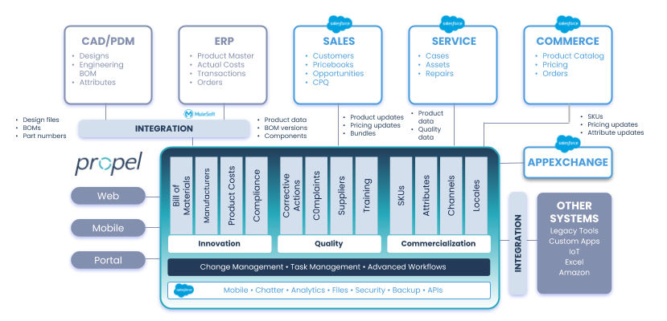

Propel Developer Docs provides information on how to extend the Propel Platform and integrate with a variety of applications. Whether the system you’re integrating with is an enterprise system, custom web application, or Salesforce app the developer docs will explain the tools you need to successfully integrate with systems critical to your organization.

Propel has various ways to integrate with applications and it is recommended to first have a firm grasp of your requirements and process flows before diving into the development. It is recommended to read our [Integration Patterns](docs/event-based-messaging) article to see how these tested approaches can be used to fulfill your requirements.

Propel is built on the [Salesforce platform](https://developer.salesforce.com/docs) and inherits the robust infrastructure that has been built by Salesforce over the past 20 years. This means that when there may not be a Propel API for doing exactly what you want, there is almost always a way to achieve your desired results by leveraging a mix of Propel APIs and Salesforce APIs. There is more information on how Salesforce and Propel work together in the context of integrations and APIs [here](/docs/salesforce-vs-propel).

