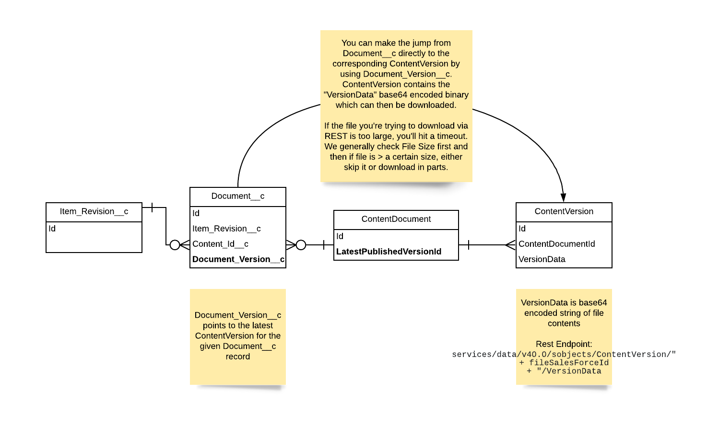
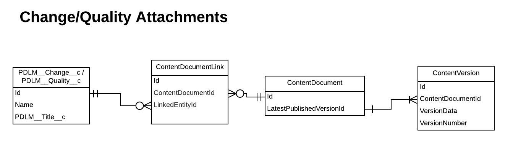

## Item Attachments
Item attachments are related to the Item Revision object. Item Revisions can has one or many versions of an attachment associated with them. Propel leverages Salesforce standard objects ContentVersion and ContentDocument to handle file versioning. For each ContentDocument associated with an Item Revision, a unique Attachment record (`PDLM__Document__c`) links the ContentDocument to an Item Revision. This also means that an Attachment can be associated to many Items.

## Change and Quality Attachments
