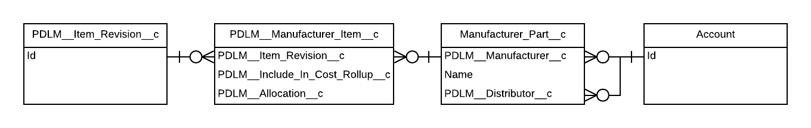
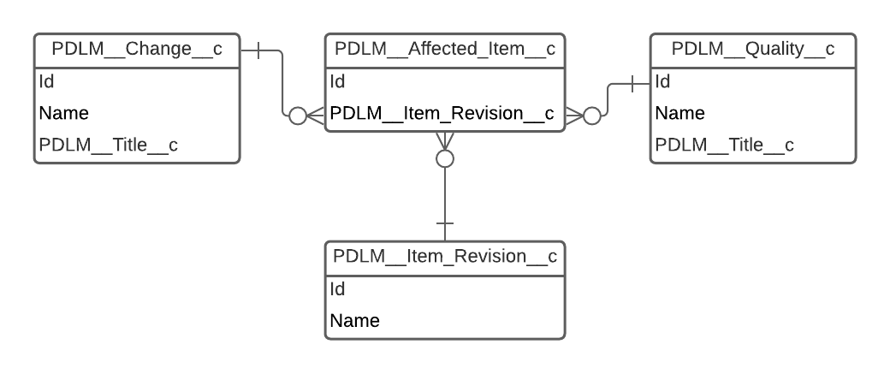

:::tip
If you haven't already, we suggest you explore the [Salesforce Schema Builder](https://help.salesforce.com/articleView?id=schema_builder_working.htm&type=5) to get an overview of all Propel objects and their relationships.
:::

Core objects in Propel are defined as objects that are used in the majority of customers' implementations. It is important to understand how these objects are related to each other as they have embedded business logic. These core objects are:

 - **PDLM\__Item\__c (Item)**
   - PDLM\__Item_Revision\__c (Item Revision)
   - PDLM\__Assembly\__c (Assembly)
   - Account (Manufacturer)
   - PDLM\__Manufacturer_Part\__c (Manufacturer Part)
   - PDLM\__Manufacturer_Item\__c (Manufacturer Item)
 - **PDLM\__Change\__c (Change)**
   - PDLM\__Affected_Item\__c (Affected Items)
 - **PDLM\__Quality\__c (Quality)**

## Item Object Model
### Item, Item Revision, Assembly

:::tip 
`PDLM__Fixed_Child_Revision__c` **is calculated at runtime**, meaning if you query the database, you will **not** see a value for this field on any records in the database. You can only retrieve the value by leveraging the `GET /v2/bom` endpoint.
:::

### Item, Manufacturer, Manufacturer Part

## Change and Quality Object Model
